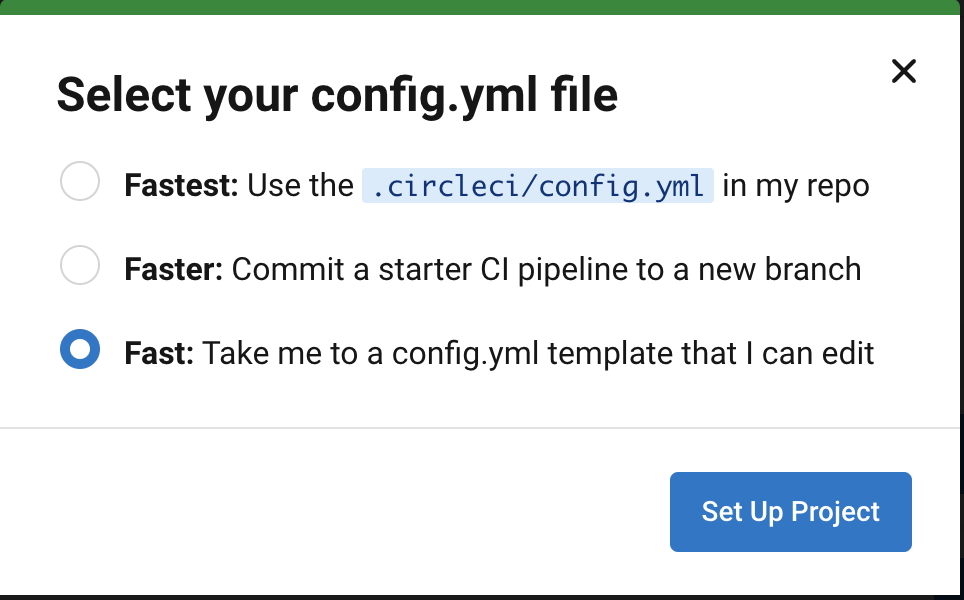
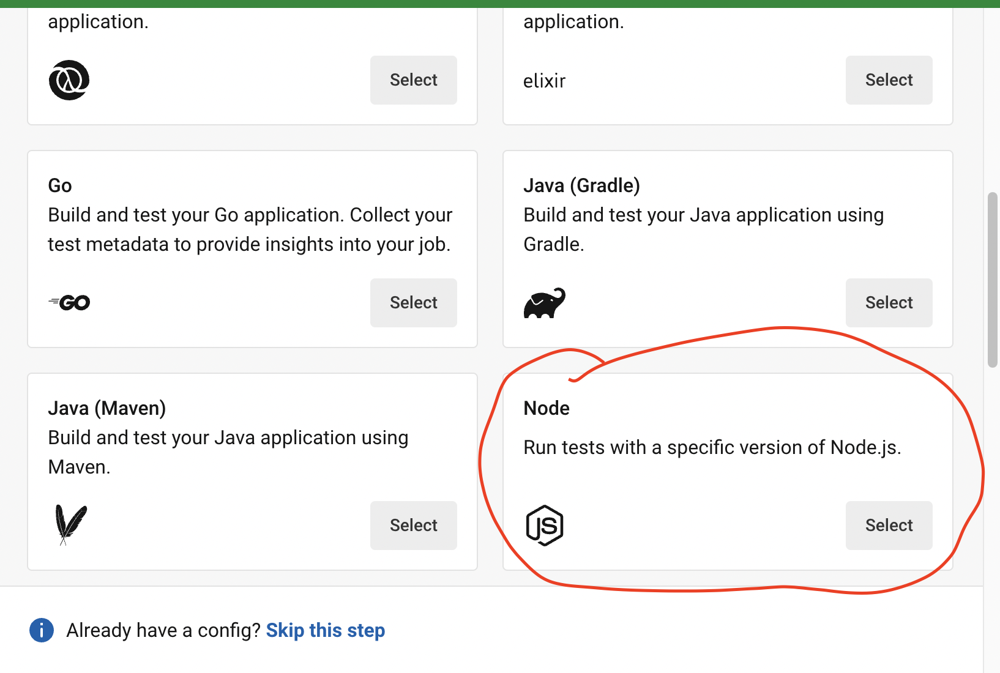
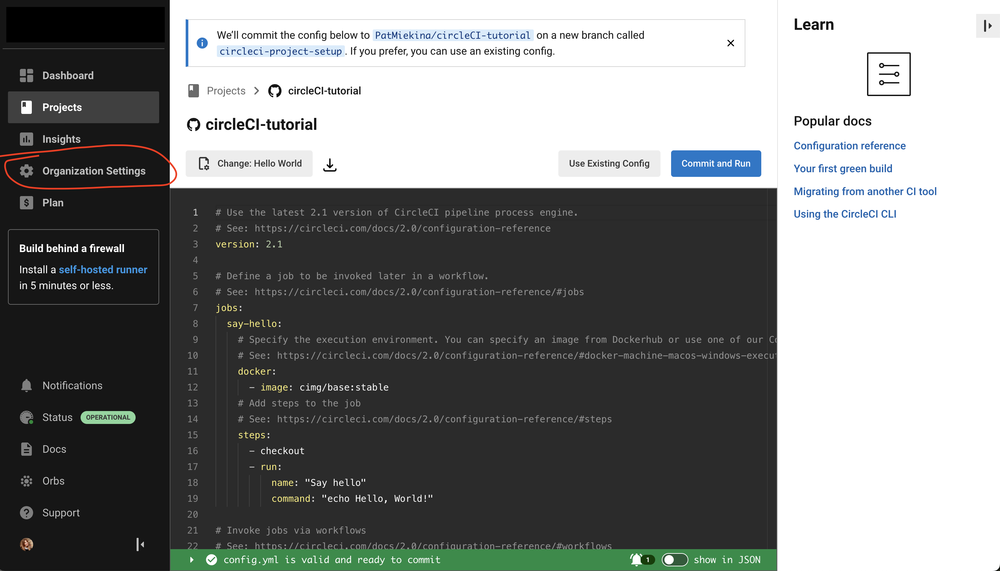
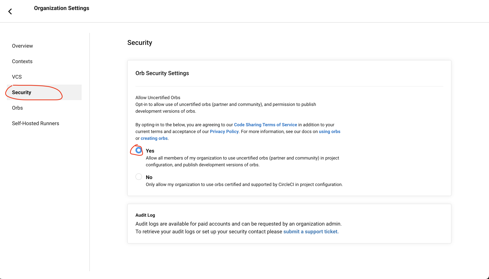
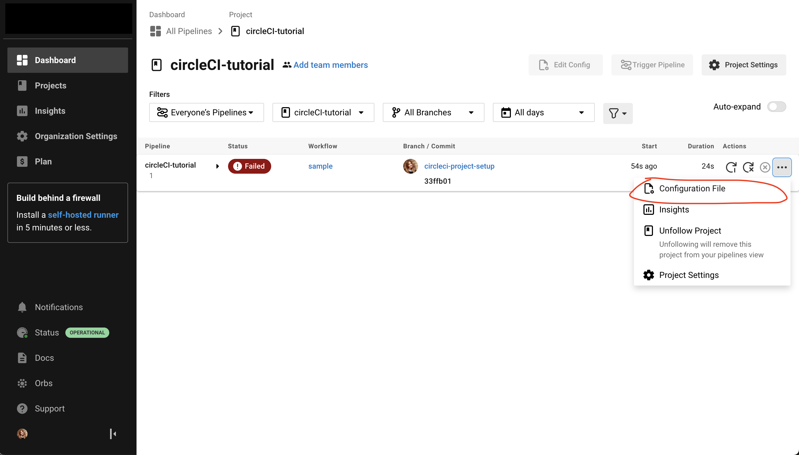
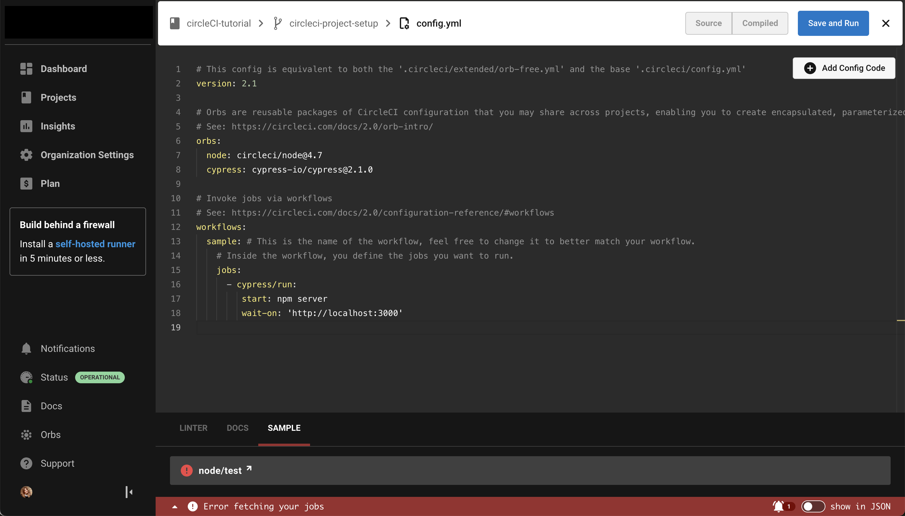
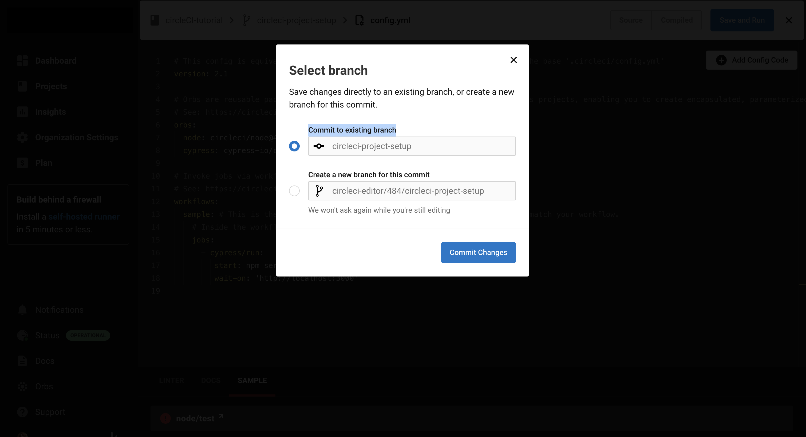
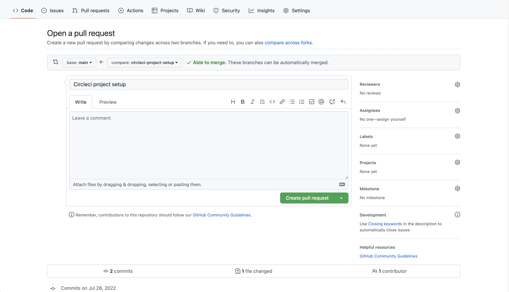

1. Create a .gitignore file (`touch .gitignore`) (if not already there). Add following to file:
```
node_modules
cypress/screenshots
cypress/videos
```

2. Install start server as a dependency
`npm install --save-dev start-server-and-test`
3. Add missing scripts to package.json
```json
"scripts": {
    "test": "echo \"Error: no test specified\" && exit 1",
    "start": "node .",
    "dev": "nodemon . & npm run scss",
    "scss": "sass --watch src/scss/main.scss public/styles/main.css",
    "cypress:open": "cypress open",
    "cypress:run": "cypress run",
    "server": "node src/index.js",
    "ci": "start-server-and-test server http://localhost:3000 cypress:run"
  },
  ```

4. Make sure your repository is pushed to github
5. Go to [CircleCI](https://circleci.com/) & log in
6. Select 'Add project' 
-> select the repository with the project from your github 
-> select Fast: Take me to config.yml template that I can edit

-> from the list select Node



7. Go to ‘organisation settings’ in left panel → security → in orb security settings select ‘yes’



8. Select 'Commit & Run' (we will be changing the config.yml) in the next steps
9. Go to main page, press on three dots of project and go to configuration file


10. Paste this into configuration file to replace existing code:

```
# This config is equivalent to both the '.circleci/extended/orb-free.yml' and the base '.circleci/config.yml'
version: 2.1

# Orbs are reusable packages of CircleCI configuration that you may share across projects, enabling you to create encapsulated, parameterized commands, jobs, and executors that can be used across multiple projects.
# See: https://circleci.com/docs/2.0/orb-intro/
orbs:
  node: circleci/node@4.7
  cypress: cypress-io/cypress@2.1.0

# Invoke jobs via workflows
# See: https://circleci.com/docs/2.0/configuration-reference/#workflows
workflows:
  sample: # This is the name of the workflow, feel free to change it to better match your workflow.
    # Inside the workflow, you define the jobs you want to run.
    jobs:
      - cypress/run:
         start: npm server
         wait-on: 'http://localhost:3000'
```

11. Select 'Save and run' and 



commit to existing branch



11. Merge CircleCI pull request branch with main branch on github



12. Pull & merge

```
git pull
```


666. In terminal run `npm run ci`